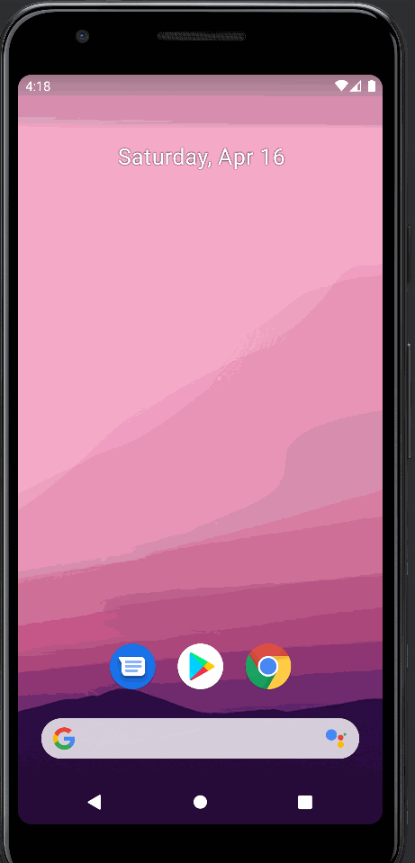
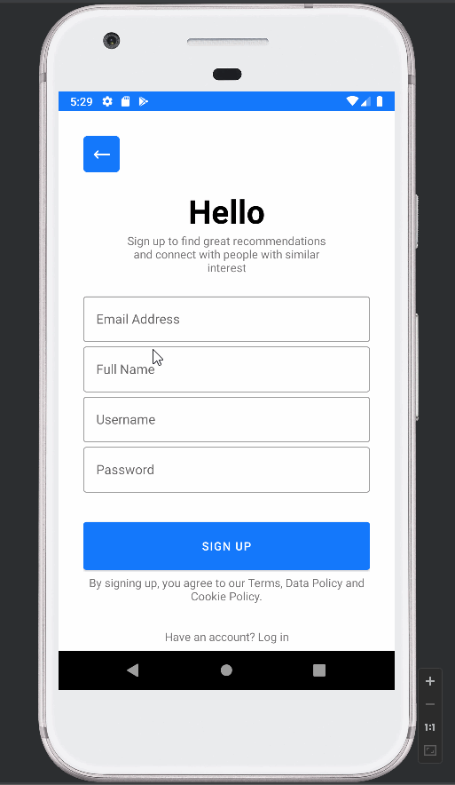

# GroupProject
Original App Design Project 
===

# FavsConnect

## Table of Contents
1. [Overview](#Overview)
1. [Product Spec](#Product-Spec)
1. [Wireframes](#Wireframes)
2. [Schema](#Schema)

## Overview
### Description
Tracks what genre of book, movies etc. an individual prefers, gives the user recommendations based on their preferred genres, and shows them users in their location with similar interests. Could be potentially used for chatting and meeting new friends with similar tastes in your area.

### App Evaluation
- **Category:** Social Networking/Personalized Reccommendation
- **Mobile:** Android
- **Story:** An app that can recommend books, movies, etc based on the users’ favorite genres. The users can also make connections with other users who have similar interests in their location.
- **Market:** This app is aiming to build connections between users in the same location based on interest in similar genres. People can be organized by location and their interests.
- **Habit:** This app could be used as frequently as the user wanted depending on how active their social life is, and what exactly they’re looking for in terms of new recommendations.
- **Scope:** First, we will show the user recommendations based on their preferred genres and then show them people in their area with similar interests. This app could potentially be used for messaging and meeting new people in you area.

## Product Spec

### 1. User Stories (Required and Optional)

**Required Must-have Stories**

- [x] Configure Parse Server to store User and Item (movie) data
- [x] Create a modern, responsive and user-friendly app UI design
- [x] Determine the APIs used to get movie and book data
- [x] New users should be able to sign up and create a profile. 
- [x] Existing users should be able to log in.
- [x] Existing users should be able to log out.
- [x] Users should be able to add and edit the information on their profile (location, contact information, etc.)
- [x] Users can select their favorite genres.
- [x] Users can view the list of recommendations (movies) based on their selected/favourite genres.
- [x] Users can view the detailed information of each movie.
- [x] Users should be able to see a list of other users in their location with similar interests.
- [x] Users can view other users' profiles.
- [x] Users can add other users as friends.
- [x] Users can recommend their favorate movies.

**Optional Nice-to-have Stories**

- [ ] Users can send messages to people who have the similar tastes with them.
- [ ] Users also can organize virtual and offline events to meet up.
- [ ] Users may receive notification on a daily or weekly basis with new recommendations.  
- [ ] Users can get recommendations (books) based on their selected/favourite genres.
- [ ] Users can get movie review information
- [ ] Users can be redirected to the movie purchase page

### 2. Screen Archetypes

* Log in screen
  * User create a new profile
  * User can log in and log out 
* Genres selection screen
  * User can select their favourite genres
* Profile screen/Setting 
  * Add, edit and view their profile information and settings
* Feed with recommendations
  * Users should be able to see a list of recommendations based on their interests
* People nearby screen
  * Users should be able to see a list of people nearby with their similar interests
* Item details screen
  * Users should be able to see the detailed information of movie/book selected 
   

### 3. Navigation

**Tab Navigation** (Tab to Screen)

* Home (Recommendations)
* Nearby
* Profile

  **Optional Nice-to-have**

* Chat (Jumps to Chat)

**Flow Navigation** (Screen to Screen)

* Forced Log-in -> Account creation if no log in is available
* Genres selection screen (new users can select their favourite genres, or update their previous choices) -> Jumps to Recommendation Feed
* Recommendation Feed -> Jumps to item details (movies, books etc.)
* Nearby -> Jumps to user profile 
* Profile/Setting -> Text field to modified (for user's own profile), Log-out option

## Wireframes


### [BONUS] Digital Wireframes & Mockups


### [BONUS] Interactive Prototype


## Schema 
### Models

Users:

<table>
<thead>
  <tr>
    <th>Property</th>
    <th>Type</th>
    <th>Description</th>
  </tr>
</thead>
<tbody>
  <tr>
    <td>Full Name</td>
    <td>String</td>
    <td>Name of the User</td>
  </tr>
  <tr>
    <td>Location</td>
    <td>String</td>
    <td>Name of the City</td>
  </tr>
  <tr>
    <td>Friends</td>
    <td>List of Pointers to Users</td>
    <td>List of Friends</td>
  </tr>
  <tr>
    <td>Recommendations</td>
    <td>List of Pointers to Item Objects</td>
    <td>List of Recommendations by the User</td>
  </tr>
  <tr>
    <td>Genres</td>
    <td>Array of String</td>
    <td>List of Genres Subscribed by the User</td>
  </tr>
  <tr>
    <td>Username</td>
    <td>String</td>
    <td>Username of the User</td>
  </tr>
  <tr>
    <td>Emails</td>
    <td>String</td>
    <td>Email of the Use</td>
  </tr>
  <tr>
    <td>Phone Number</td>
    <td>String</td>
    <td>Phone Number of the User</td>
  </tr>
  <tr>
    <td>Password</td>
    <td>String</td>
    <td>Password of the User</td>
  </tr>
</tbody>
</table>

Items:

<table>
<thead>
  <tr>
    <th>Property</th>
    <th>Type</th>
    <th>Description</th>
  </tr>
</thead>
<tbody>
  <tr>
    <td>Item Id</td>
    <td>String</td>
    <td>Unique id for the item (default field)</td>
  </tr>
  <tr>
    <td>Item Type</td>
    <td>String</td>
    <td>What is the item type? (movies or books)</td>
  </tr>
  <tr>
    <td>Title</td>
    <td>String</td>
    <td>Title of the Movie (or Book)</td>
  </tr>
  <tr>
    <td>Genre</td>
    <td>Array of String</td>
    <td>Genres related to the item</td>
  </tr>
  <tr>
    <td>Synopsis</td>
    <td>String</td>
    <td>Short Description of the item</td>
  </tr>
  <tr>
    <td>Image</td>
    <td>File</td>
    <td>Image that defines the item</td>
  </tr>
  <tr>
    <td>Recommended by</td>
    <td>List of Pointers to Users</td>
    <td>Recommenders</td>
  </tr>
  <tr>
    <td>No. of Recommendations</td>
    <td>Number</td>
    <td>number of recommendations for the item</td>
  </tr>
  <tr>
    <td>Links</td>
    <td>Array of String</td>
    <td>Links to the item on store pages</td>
  </tr>
</tbody>
</table>

### Networking

<ul>
  <li> Login Screen
    <ul>
      <li> (Read/GET) Query logged in user object </li>
    </ul>
  </li>
  
  <li> Profile
    <ul>
      <li> (Update/PUT) Create new User Object </li>
      <li> (Update/PUT) Update user object </li>
      <li> (Read/GET) (Read/GET) Query Details of a User Object </li>
    </ul>
  </li>
  
  <li> Recommendations
    <ul>
      <li> (Read/GET) Query all recommendations (including details) which match the user’s selected genres </li>
      <li> (Create/POST) Create a new “Recommendation/Favourite” on an item </li>
      <li> (Delete) Delete existing recommendation </li>
    </ul>
  </li>
  
  <li> Details
    <ul>
      <li> (Read/GET) Query to get all comments of the item </li>
      <li> (Create/POST) Create a new comment on a post </li>
      <li> (Delete) Delete existing comment </li>
    </ul>
  </li>
  
  <li> Users Nearby
    <ul>
      <li> (Read/GET) Query users based on their location (same city?) </li>
      <li> (Create/POST) Send a Friend Request </li>
    </ul>
  </li>
  
  <li> Genre Choose Screen:
    <ul>
      <li> (Read/GET) Query all genres added by the User </li>
      <li> (Create/POST) Create list of genres selected by the User </li>
      <li> (Update/PUT) Update list of genres selected by the User </li>
    </ul>
  </li>
</ul>

- Example query: Query all recommendations (including details) which match the user’s selected genres
```kotlin
        val query: ParseQuery<Item> = ParseQuery.getQuery(Post::class.java)
        // Find all recommendation items from the log in user
        query.include(Item.KEY_USER)
        query.findInBackground { recommendationList, e ->
            if (e == null) {
                Log.i("Recommendations", "Retrieved " + recommendationList.size + " recommendations")
            } else {
                e.printStackTrace()
            }
        }
```
- [OPTIONAL: List endpoints if using existing API such as Yelp]

## Video Walkthrough

### Sprint 1
Here's a walkthrough of implemented user stories:



### Sprint 2
Here's a walkthrough of implemented user stories:



### Sprint 3 (Final Sprint)
Here's a walkthrough of implemented user stories:


GIF created with [LiceCap](http://www.cockos.com/licecap/).

## Notes

Describe any challenges encountered while building the app.

## Open-source libraries used

- [Android Async HTTP](https://github.com/codepath/CPAsyncHttpClient) - Simple asynchronous HTTP requests with JSON parsing
- [Glide](https://github.com/bumptech/glide) - Image loading and caching library for Android
